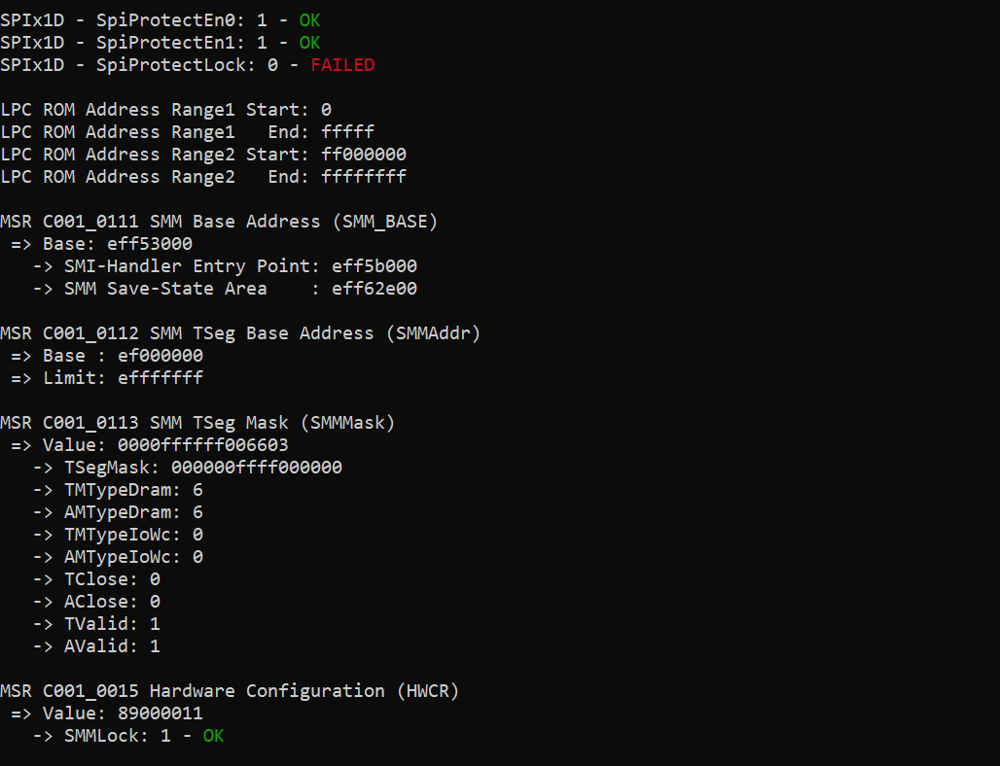

# Platbox
UEFI and SMM Assessment Tool

## Features

Platbox is a tool that helps assessing the security of the platform:

- Dumps the platform registers that are interesting security-wise
    - Flash Locks
    - MMIO and Remapping Locks
    - SMM Base and Locks
    - MSRs
- RW access to the PCI configuration space of devices.
- RW to physical memory and virtual memory.
- Allows allocating physical memory and map memory to usermode.
- Read and Write MSRs.
- Dump SPI Flash content (BIOS) into a file.
- Basic dumb SMI Fuzzer.
- Dump S3 Bootscript (from SMM-Lockbox) into a file.
- Dump EFI Memory Map (Linux only for now).
- List UEFI variables.
- Supports Linux and Windows.
- Supports Intel and AMD.

### Example of 'chipset' command output for an AMD platform

## Project Structure

The project is divided as follows:

- Platbox: kernel drivers used for Linux and Windows.
- PlatboxClient: the usermode component that loads the kernel driver and access to al the previously listed features.

## TODOs

- Implement DSE Bypass
- Retrieve the EFI memory map and SMM_CORE_PRIVATE struct from Windows (in progress)
- Give the option to perform register changes in all the cores
- Grab SMI port automatically and remove hardcoded 0xb2